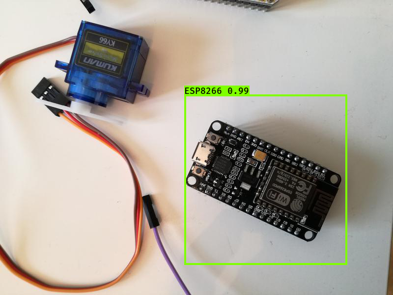
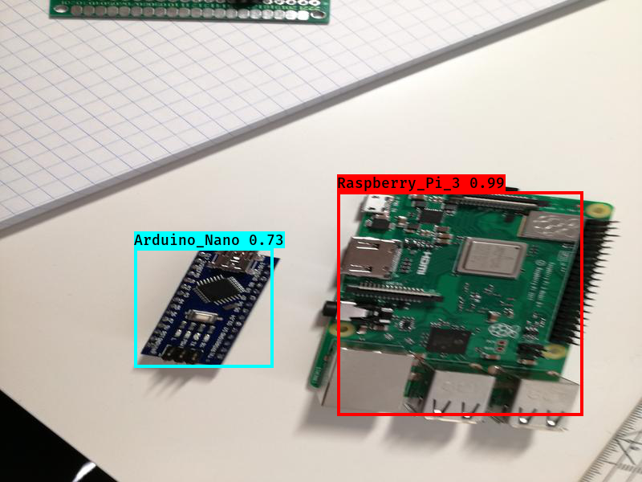

# Object detection with [keras-yolo3](https://github.com/qqwweee/keras-yolo3)


This repository contains a step-by-step guide on how to use [keras-yolo3](https://github.com/qqwweee/keras-yolo3) for both inference and training a custom model.

## What is Yolo?

YOLO is one of the primary three types of object detectors you'll encounter:
* R-CNN
* SSD (Single Shot Detectors)
* YOLO (You only look once).

YOLO works completely different than most other object detection architectures. Most methods the model to an image at multiple locations and scales. High scoring regions of the image are considered detections. Yolo, on the other hand, applies a single neural network to the full image. The network divides the image into regions and predicts bounding boxes and probabilities for each region. These bounding boxes are weighted by the predicted probabilities.

## Installation

To run keras-yolo3, you'll have to install the following packages:
* Tensorflow 
* Keras
* Pillow

The library was built for older Keras versions, so you might experience problems if you are using the newest versions.

Tested versions:
* Keras 2.1.5
* Tensorflow 1.6.0

After you've installed the needed dependencies you need to clone the repository using the following command:

```bash
git clone https://github.com/qqwweee/keras-yolo3.git
```

## Using Docker

If you don't want to install keras-yolo3 locally, I created a Docker image, which will automatically install all the required dependencies and clone the repository.

You can find the Dockerfile and docker-compose.yml in the Docker directory.

## Testing installation by running a pre-trained model

You can test your installation by following the below steps:
1. Download YOLOv3 weights from YOLO website.
2. Convert the Darknet YOLO model to a Keras model.
3. Run YOLO detection.

We'll work through this step-by-step.

You can download the weights for all YOLO model from [https://pjreddie.com/](https://pjreddie.com/). I'll download the weights for the yolo3 model by runnning the below command:

```bash
wget https://pjreddie.com/media/files/yolov3.weights
```

The model can be converted to a Keras compatible file using the ```convert.py``` script.

```bash
python convert.py yolov3.cfg yolov3.weights model_data/yolo.h5
```

Now you should have a file called yolo.h5 in the model_data directory. This model can now be used for inference with the yolo_video.py file. Unfortunately the yolo_video.py file in the repository contains a bug concerning the parsing of the argument. This was  fixed by Github User [Xiaokeai18](https://github.com/Xiaokeai18), who opened a [pull request](https://github.com/qqwweee/keras-yolo3/pull/588) fixing the error, which Unfortunately wasn't accepted into the repository yet.

You can find the yolo_video.py change with the bug fixes in this repository.

### Running the yolo_video.py script

Using the yolo_video.py script you can run the object detection model on both an image and a video. You can find a list of all the arguments you can parse to yolo_video.py by specifying the --help flag.

```bash
usage: yolo_video.py [-h] [--model MODEL] [--anchors ANCHORS]
                     [--classes CLASSES] [--gpu_num GPU_NUM] [--image]
                     [--input] [--output]

positional arguments:
  --input        Video input path
  --output       Video output path

optional arguments:
  -h, --help         show this help message and exit
  --model MODEL      path to model weight file, default model_data/yolo.h5
  --anchors ANCHORS  path to anchor definitions, default
                     model_data/yolo_anchors.txt
  --classes CLASSES  path to class definitions, default
                     model_data/coco_classes.txt
  --gpu_num GPU_NUM  Number of GPU to use, default 1
  --image            Image detection mode, will ignore all positional arguments
```

#### Running model on an image:

```bash
wget https://raw.githubusercontent.com/tensorflow/models/master/research/object_detection/test_images/image1.jpg

python yolo_video.py --model model_data/yolo.h5 --classes model_data/coco_classes.txt --image
```

After entering the above commands, the model will load into memory, and you'll be able to specify the path to an image. After specifying the path, the model will try to detect all objects inside that image and show the result using matplotlib.


#### Running model on video

If you don't specify the --image flag you'll have to specify the path to a video as well as a path to save the output to.

```bash
wget http://www.robots.ox.ac.uk/ActiveVision/Research/Projects/2009bbenfold_headpose/Datasets/TownCentreXVID.avi

python yolo_video.py --input TownCentreXVID.avi --output pedestrian_detection.avi
```
[](https://www.youtube.com/watch?v=HMVosvA2tHk)

## Training custom model

keras-yolo3 also allows you to train your own custom yolo models. To do so, you need to follow the below steps (taken from the [official README](https://github.com/qqwweee/keras-yolo3)):

1. Generate your own annotation file and class names file.  
    One row for one image;  
    Row format: `image_file_path box1 box2 ... boxN`;  
    Box format: `x_min,y_min,x_max,y_max,class_id` (no space).  
    For VOC dataset, try `python voc_annotation.py`  
    Here is an example:
    ```
    path/to/img1.jpg 50,100,150,200,0 30,50,200,120,3
    path/to/img2.jpg 120,300,250,600,2
    ...
    ```

2. Make sure you have run `python convert.py -w yolov3.cfg yolov3.weights model_data/yolo_weights.h5`  
    The file model_data/yolo_weights.h5 is used to load pretrained weights.

3. Modify train.py and start training.  
    `python train.py`  
    Use your trained weights or checkpoint weights with command-line option `--model model_file` when using yolo_video.py
    Remember to modify class path or anchor path, with `--classes class_file` and `--anchors anchor_file`.

## Training custom model example

To make the steps more clear, we'll work through a real-world example. For the example, we'll use my microcontroller detection data-set, which is available on [my Kaggle account](https://www.kaggle.com/tannergi/microcontroller-detection). 



```bash
kaggle datasets download -d tannergi/microcontroller-detection
```

1. **Generate your own annotation file and class names file.**  
    We have two options to generate the yolo txt file from the microcontroller-detection data-set. We can either read in the csv files, which where generated with the [xml_to_csv.py file](./xml_to_csv.py) or we can load in the xml files generated with [labelImg](https://github.com/tzutalin/labelImg) directly.

    **csv to txt**

    You can convert the csv file to txt by executing the ```csv_to_yolo_annotation.py``` script.

    ```bash
    usage: csv_to_yolo_annotation.py [-h] -i INPUT [-f FOLDER] [-o OUTPUT]

    CSV to Yolo

    optional arguments:
      -h, --help            show this help message and exit
      -i INPUT, --input INPUT
                            Path to csv file
      -f FOLDER, --folder FOLDER
                            Image folder (if filenames are relativ)
      -o OUTPUT, --output OUTPUT
                            Output path
    ```

    For the microcontroller_dataset the command looks like the following:
    ```bash
    python csv_to_yolo_annotation.py -i train_labels.py -f train -o ./ 
    ```
    
    **xml to txt**

    You can convert the csv file to txt by executing the ```voc_annotation.py``` script.

    ```bash
    usage: voc_annotation.py [-h] -i INPUT [-f FOLDER] -c CLASSES [CLASSES ...]
                             [-o OUTPUT]

    VOC to YOLO

    optional arguments:
      -h, --help            show this help message and exit
      -i INPUT, --input INPUT
                            Path to input folder
      -f FOLDER, --folder FOLDER
                            Image folder (if filenames are relativ)
      -c CLASSES [CLASSES ...], --classes CLASSES [CLASSES ...]
                            Classes
      -o OUTPUT, --output OUTPUT
                            Output path
    ```

    For the microcontroller_dataset the command looks like the following:
    ```bash
    python voc_annotation.py -i train/ -f train/ -c Arduino_Nano Heltec_ESP32_Lora ESP8266 Raspberry_Pi_3 -o ./
    ```

2. Make sure you have run `python convert.py -w yolov3.cfg yolov3.weights model_data/yolo_weights.h5`  
    The file model_data/yolo_weights.h5 is used to load pretrained weights.
    
3. **Modify train.py and start training.**  
    Inside the ```train.py``` file you'll have to change the ```annotation_path``` and ```classes_path``` to match the paths to the files created in step 1. You also might need to change the batch_size in line 57 and 76 depending on how much VRAM your graphics card has.

    After changing the train.py file you can start training by calling:
    ```python train.py```

    This will start the training process and will save all the files inside the specified log directory.

## Using the custom model
 
After the training has finished, you can use the model as I described in the "Testing installation by running a pre-trained model" section.

```bash
python yolo_video.py --model logs/000/trained_weights_final.h5 --classes classes.txt --image
```

