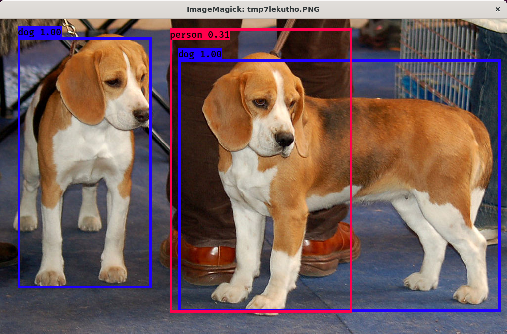

# YOLO Tutorials

This repository contains the code for my YOLO Object Detection Tutorials.

## Tutorials
* [YOLO Object Detection with Darknet](YOLO-Object-Detection-with-Darknet)
* [YOLO Object Detection with OpenCV](YOLO-Object-Detection-with-OpenCV)
* [YOLO Object Detection with keras-yolo3](Object-detection-with-keras-yolo3)
* [YOLO Object Detection in PyTorch](YOLO-Object-Detection-in-PyTorch)

## Author
 **Gilbert Tanner**
 
## Support me

## License

This project is licensed under the MIT License - see the [LICENSE.md](LICENSE) file for details