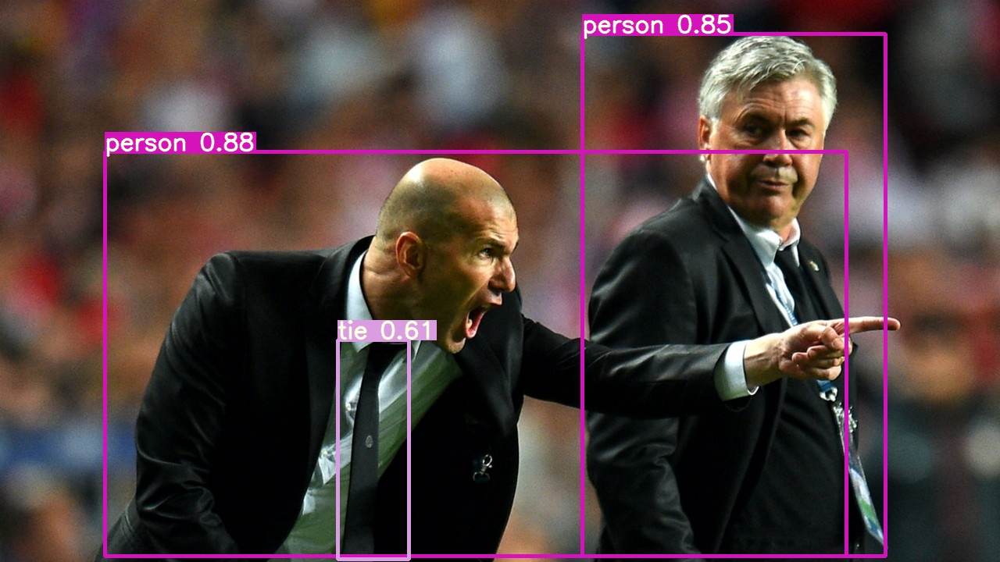
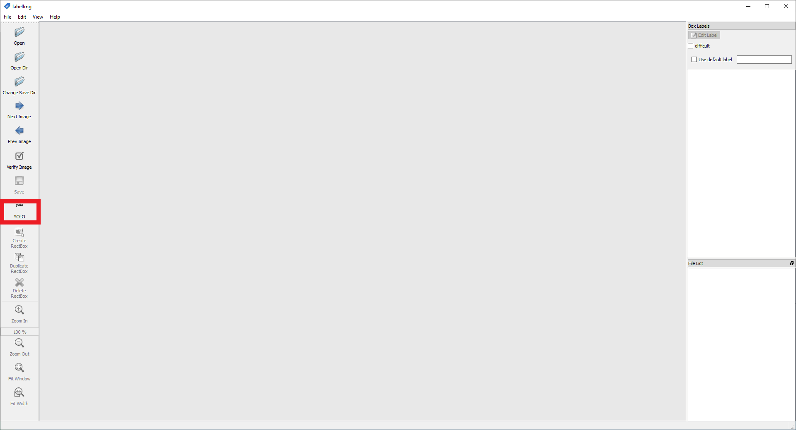
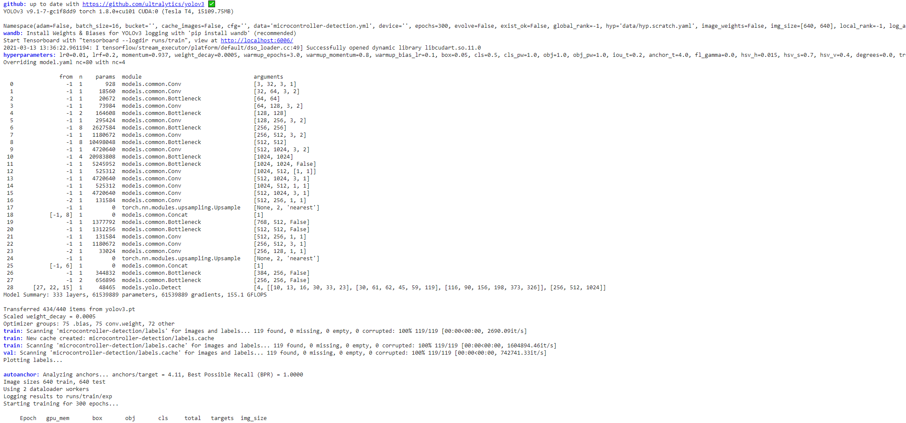

# YOLO Object Detection in PyTorch



## Installation

[yolov3](https://github.com/ultralytics/yolov3) can be installed by cloning the repository and installing the dependencies located inside the [requirements.txt file](https://github.com/ultralytics/yolov3/blob/master/requirements.txt).

```bash
git clone https://github.com/ultralytics/yolov3
cd yolov3
pip install -U -r requirements.txt
```

## Detection Using A Pre-Trained Model

You can run an object detection model using the ```detect.py``` file. You can find a list of all the arguments you can parse to ```detect.py``` by specifying the --help flag.

```bash
usage: detect.py [-h] [--cfg CFG] [--names NAMES] [--weights WEIGHTS]
                 [--source SOURCE] [--output OUTPUT] [--img-size IMG_SIZE]
                 [--conf-thres CONF_THRES] [--iou-thres IOU_THRES]
                 [--fourcc FOURCC] [--half] [--device DEVICE] [--view-img]
                 [--save-txt] [--classes CLASSES [CLASSES ...]]
                 [--agnostic-nms] [--augment]

optional arguments:
  -h, --help            show this help message and exit
  --cfg CFG             *.cfg path
  --names NAMES         *.names path
  --weights WEIGHTS     weights path
  --source SOURCE       source
  --output OUTPUT       output folder
  --img-size IMG_SIZE   inference size (pixels)
  --conf-thres CONF_THRES
                        object confidence threshold
  --iou-thres IOU_THRES
                        IOU threshold for NMS
  --fourcc FOURCC       output video codec (verify ffmpeg support)
  --half                half precision FP16 inference
  --device DEVICE       device id (i.e. 0 or 0,1) or cpu
  --view-img            display results
  --save-txt            save results to *.txt
  --classes CLASSES [CLASSES ...]
                        filter by class
  --agnostic-nms        class-agnostic NMS
  --augment             augmented inference
```

The source could be an image, video, directory of images, webcam or an image stream.

* Image: --source file.jpg
* Video: --source file.mp4
* Directory: --source dir/
* Webcam: --source 0
* RTSP stream: --source rtsp://170.93.143.139/rtplive/470011e600ef003a004ee33696235daa
* HTTP stream: --source http://wmccpinetop.axiscam.net/mjpg/video.mjpg

If you don't specify a source, it uses the data/samples folder. The results will automatically be saved inside the output folder.

```
python3 detect.py
```


```
wget http://www.robots.ox.ac.uk/ActiveVision/Research/Projects/2009bbenfold_headpose/Datasets/TownCentreXVID.avi
python3 detect.py --source TownCentreXVID.avi
```

[](https://www.youtube.com/watch?v=9Mdc-HU6BV8)

## Train on custom data

### 1. Create annotations

After collecting your images, you'll have to annotate them. For YOLO, each image should have a corresponding .txt file with a line for each ground truth object in the image that looks like:

```bash
<object-class> <x> <y> <width> <height>
```

The .txt file should have the same name as the image. All images should be located inside a folder called images and all labels should be located inside the labels folder. 

You can get such labels using an annotation tool like [labelImg](https://github.com/tzutalin/labelImg), which supports both Pascal VOC and YOLO (just make sure that you have selected YOLO).



If you have a dataset with PASCAL VOC labels you can convert them using the [```convert_voc_to_yolo.py``` script](convert_voc_to_yolo.py). Before you execute the file you'll have to change the classes list to fit your dataset. After that you can run the script:

```bash
python convert_voc_to_yolo.py
```

### 2. Create names file

The .name file lists all the class names in your dataset. The order should match the classes list inside the convert_voc_to_yolo.py file.

```bash
Arduino_Nano
Heltec_ESP32_Lora
ESP8266
Raspberry_Pi_3
```

### 3. Create a data file

The .data file contains information regarding the training and testing set.

```bash
classes=4
train=microcontroller-detection/train.txt
valid=microcontroller-detection/test.txt
names=microcontroller-detection/microcontroller.names
```

### 4. Modify configuration file

As a base config we'll use the [yolov3.cfg file](https://github.com/ultralytics/yolov3/blob/master/cfg/yolov3.cfg) located inside the cfg directory. You can copy the file and save it inside the root directory.

Inside the file we'll make the following changes.

By default each YOLO layer has 255 outputs: 85 values per anchor [4 box coordinates + 1 object confidence + 80 class confidences], times 3 anchors. Update the settings to filters=[5 + n] * 3 and classes=n, where n is your class count. This modification should be made in all 3 YOLO layers. 

### 5. Start Training

Now that you have created all the needed file you can start the training process by typing:

```bash
python train.py --data microcontroller-detection/microcontroller.data --cfg yolov3.cfg --weights '' --epochs 300 --batch 16
```

