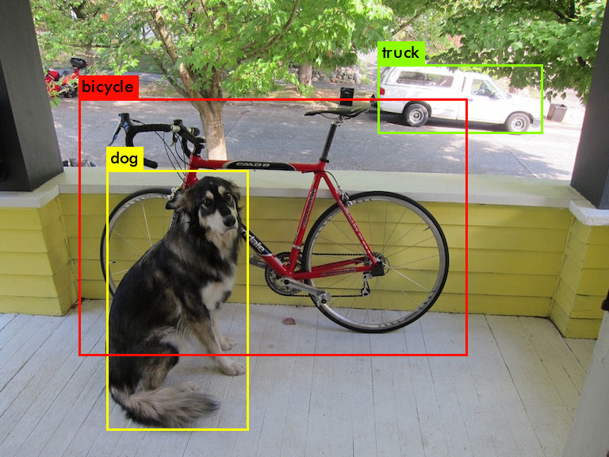
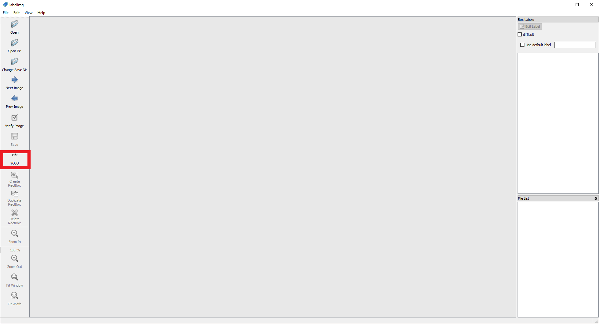
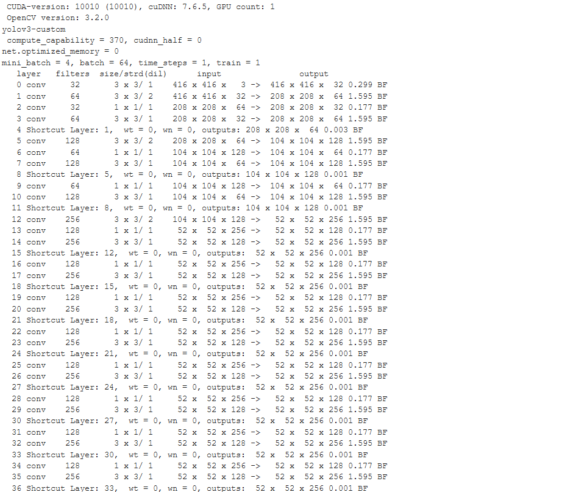

# YOLO Object Detection


## Installing Darknet

If you don't already have Darknet installed, you'll have to [install it](https://pjreddie.com/darknet/install). Darknet can be installed for both CPU or GPU. You can also compile with OpenCV if you want support for more image formats. 

## Detection Using A Pre-Trained Model

To run object detection with Darknet, you need a model config and model weights. The config files can be found in the ```cfg``` subdirectory. You'll have to download the pre-trained weights:

```bash
wget https://pjreddie.com/media/files/yolov3.weights
wget https://pjreddie.com/media/files/yolov3-tiny.weights
```

After you've downloaded the weights, you can run the detector on an image.

```bash
./darknet detect cfg/yolov3.cfg yolov3.weights data/dog.jpg
```

You will see an output like this:

```bash
layer     filters    size              input                output
    0 conv     32  3 x 3 / 1   416 x 416 x   3   ->   416 x 416 x  32  0.299 BFLOPs
    1 conv     64  3 x 3 / 2   416 x 416 x  32   ->   208 x 208 x  64  1.595 BFLOPs
    .......
  105 conv    255  1 x 1 / 1    52 x  52 x 256   ->    52 x  52 x 255  0.353 BFLOPs
  106 detection
truth_thresh: Using default '1.000000'
Loading weights from yolov3.weights...Done!
data/dog.jpg: Predicted in 0.029329 seconds.
dog: 99%
truck: 93%
bicycle: 99%
```



Tiny YOLO:

```bash
./darknet detect cfg/yolov3-tiny.cfg yolov3-tiny.weights data/dog.jpg
``` 


## Real-Time Detection on a Webcam/video

Using Darknet you can also run a YOLO model on a webcam or video. For this, you will need to have [Darknet with CUDA and OpenCV](https://pjreddie.com/darknet/install/#cuda). To run the model on the webcam, execute the following command:

```bash
./darknet detector demo cfg/coco.data cfg/yolov3.cfg yolov3.weights
```

YOLO will display the current FPS and predicted classes as well as the image with bounding boxes drawn on top of it.

You can run it on a video by providing the video path at the end of the command.

```bash
./darknet detector demo cfg/coco.data cfg/yolov3.cfg yolov3.weights <video file>
```

YOLO Example:

```bash
wget http://www.robots.ox.ac.uk/ActiveVision/Research/Projects/2009bbenfold_headpose/Datasets/TownCentreXVID.avi

./darknet detector demo cfg/coco.data cfg/yolov3.cfg yolov3.weights TownCentreXVID.avi
```

[](https://www.youtube.com/watch?v=O4ZwnhrpLlw)

TinyYOLO Example:

```bash
wget http://www.robots.ox.ac.uk/ActiveVision/Research/Projects/2009bbenfold_headpose/Datasets/TownCentreXVID.avi

./darknet detector demo cfg/coco.data fg/yolov3-tiny.cfg yolov3-tiny.weights TownCentreXVID.avi
```

[](https://www.youtube.com/watch?v=d2-x8qwK1f4)

> Note: Standardly, Darknet doesn't support saving the video. If you want to save the image you have to use [AlexeyAB/darknet](https://github.com/AlexeyAB/darknet), a fork of the original darknet repository with some added features. Using this, you can save the video by specifying the ```-out_filename``` argument. You can also choose not to display the video if you're for example connected to a remote machine by specifying ```-dont_show```.

```bash
./darknet detector demo cfg/coco.data cfg/yolov3.cfg yolov3.weights TownCentreXVID.avi -dont_show -out_filename yolo_pedestrian_detection.avi
```

## Training YOLO model

Darknet also allows you to train your own custom YOLO models. To do so, you need to follow the below steps:

### 1. Create annotations

After collecting your images, you'll have to annotate them. For YOLO, each image should have a corresponding .txt file with a line for each ground truth object in the image that looks like:

```bash
<object-class> <x> <y> <width> <height>
```

The .txt file should have the same name as the image and should be placed inside the same directory. 

You can get such labels using an annotation tool like [labelImg](https://github.com/tzutalin/labelImg), which supports both Pascal VOC and YOLO (just make sure that you have selected YOLO).



If you have a dataset with PASCAL VOC labels you can convert them using the [```convert_voc_to_yolo.py``` script](convert_voc_to_yolo.py). Before you execute the file you'll have to change the dirs and classes lists to fit your dataset. After that you can run the script:

```bash
python convert_voc_to_yolo.py
```

### 2. Create names file

The .name file lists all the class names in your dataset. The order should match the classes list inside the convert_voc_to_yolo.py file.

```bash
Arduino_Nano
Heltec_ESP32_Lora
ESP8266
Raspberry_Pi_3
```

### 3. Create a data file

The .data file contains information regarding the training and testing set.

```bash
classes=4
train=train=microcontroller-detection/train.txt
valid=microcontroller-detection/test.txt
names=names=microcontroller-detection/custom.names
backup=backup/
```

### 4. Modify configuration file

As a base config we'll use the [yolov3.cfg file](https://github.com/pjreddie/darknet/blob/master/cfg/yolov3.cfg) located inside the cfg directory. You can copy the file and save it under yolov3-custom.cfg.

Inside the file we'll make the following changes.

By default each YOLO layer has 255 outputs: 85 values per anchor [4 box coordinates + 1 object confidence + 80 class confidences], times 3 anchors. Update the settings to filters=[5 + n] * 3 and classes=n, where n is your class count. This modification should be made in all 3 YOLO layers. 

### 5. Start Training

Now that you have created all the needed file you can start the training process by typing:

```bash
wget https://pjreddie.com/media/files/darknet53.conv.74
./darknet detector train detector.data yolov3-custom.cfg darknet53.conv.74
```

